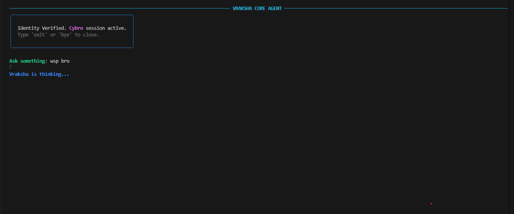

# Vraksha

<p align="center">
  
</p>

<!-- A local-first agent runtime. Input gets pushed through a security pipeline
before any model touches it, an orchestrator drives tools and sub-agents to do
the actual work, and memory carries context across sessions instead of starting
cold every run.
-->

**Vraksha**: Run a security focused agent on your own machine locally.
Every input you send goes through a security pipeline before any model touches it.
**Vraksha** also uses an orchestrator + sub agents architecture which helps it run specialized workflow
without the orchestrator itself having to know everything.
And the important part is that your context is carried across all (mostly) sessions instead of having to
start all over again everytime you start a new session.

It runs end to end from the CLI today. There's no server or frontend in this
repo, delivery is terminal-only here.

## How the pipeline works
**Vraksha** uses `Flow`, a custom data pipeline for **Vraksha**.
**Flow:** The only part responsible for flowing data from one layer to another without
processing anything on its own, instead it just automatically does y if doing x without y
could lead to disaster and gives the system apis which allows them to get the data when
they need and it also passes data from one layer to another on the basis of contract defined

One thing moves between stages: a `Flow`. No free-form strings, just `Flow`. Each stage
takes a `Flow` and hands back a `Flow` carrying the payload, request context,
trace metadata, status, and a running journal of what every stage did. When a
run dies six stages deep, that journal is the whole debugging story.

> The layers:
```text
intake -> sanitizer -> normalizer -> verifier -> orchestrator -> output filter -> delivery
```

**intake:** It includes rate-limits, caps raw input size, detects the modality, and keeps the
original input in request context.

**sanitizer:** It runs ClamAV and YARA together as a pre-gate to validate the input,
then fans out to per-modality workers (text, PDF, image, audio, video) that validate
and scrub without flattening quality in the process.

**normalizer:** It turns sanitized bytes into a structured `NormalizedInput`. Text
and PDFs collapse to Unicode-normalized text, scanned PDFs get routed to an OCR
expert, and image/audio/video stay native when the downstream model can take
them. No LLM is included in this stage, by design because normalization that hallucinates isn't
normalization.

**verifier:** It is a small fast model (Gemini by default) that makes the
input-safety call. The deterministic regex pass in front of it is only a hint.
The model takes decisions, and its output is structured data form, never prose
or free form text.

**orchestrator:** It is a reasoning loop of **Vraksha**. The model
emits one structured decision per turn, the loop executes it, and a decision log
streams out as it goes. Experts (web research, writer/synthesis) are full agents
with their own prompt, skills, and scoped tools. Tools (web_search, fetch_url,
sandboxed Python, calculator) sit behind a permissioned handler. Both
self-register through one capability registry via `@tool` / `@expert` and get
auto-discovered, so adding a capability is a decorated file dropped in a folder,
no wiring.

```text
# Examples;

from regstry import tool

@tool
class CalculatorTool:
    name = "calculator"
    domain = "math"
    description = "Evaluate a basic arithmetic expression (+ - * / // % ** and parentheses)."
    input_schema = CalcIn # Input data schema class 
    output_schema = CalcOut # Output data schema class
    permission = PermissionLevel.READ
    tags = ("math",)

    async def run(self, args: CalcIn) -> CalcOut:
        tree = ast.parse(args.expression, mode="eval")
        return CalcOut(result=_eval(tree.body))
```

**output filter:** It is a final safety and groundedness pass on the draft that gets generated
in the previous layers.

**delivery** ships the final output. *Vraksha* only has CLI for now.

## Memory

- **wiki:** User-authored, highest trust, wins every conflict
- **semantic:** Durable facts that *Vraksha* learns
- **episodic:** Session history, the baseline tier
- **procedural:** The processes that *Vraksha* learnt it should do in certain conditions.

## Layout

```text
foundation/   Flow, context, constants, shared types, model registry
core/         intake, normalizer, verifier, orchestrator, memory, llm adapter
security/     sanitizers + output filter
delivery/     terminal stage (CLI)
models.yaml   per-stage provider routing, Gemini default
prompts/      versioned system prompts as markdown, indexed by registry.yaml
```

If you're reading the code, start here:

- [foundation/README.md](foundation/README.md)
- [foundation/FLOW_GUIDE.md](foundation/FLOW_GUIDE.md)
- [core/README.md](core/README.md)
- [security/sanitizers/README.md](security/sanitizers/README.md)

## For the devs (see below for normal installations)

```bash
git clone https://github.com/vraksha/vraksha
cd vraksha
python -m venv .venv
source .venv/bin/activate
python -m pip install -r requirements.txt
cp .env.example .env.local
```

Only set keys for providers you'll actually use. Gemini is the default, so
`GOOGLE_API_KEY` (or `GEMINI_API_KEY`) is the only one that matters unless you
edit `models.yaml`. `main.py` loads `.env.local` at startup and the provider
SDKs read from the environment.

```env
GOOGLE_API_KEY=
ANTHROPIC_API_KEY=
OPENAI_API_KEY=
OPENROUTER_API_KEY=
MISTRAL_API_KEY=
GROQ_API_KEY=
HF_TOKEN=
```

ClamAV runs as a daemon, and the media workers need a few system packages, so u gotta do:

```bash
docker compose up -d clamav

# debian/ubuntu
sudo apt-get install -y ffmpeg libimage-exiftool-perl libmagic1
# macos
brew install ffmpeg exiftool libmagic
```

If your `clamd` isn't on the defaults:

```env
CLAMAV_HOST=127.0.0.1
CLAMAV_PORT=3310
AGENT_YARA_DIR=rules
```

That's the whole setup. Jump to **Using it** below to actually run it.

## Installation

This is the path if you just want to run it, no cloning involved. You need
**Docker** with the Compose plugin (installed and running) and **git**, on
Linux, WSL, or macOS. The installer pulls everything else (ClamAV, ffmpeg,
exiftool, the PDF tools), clones into `~/.vraksha`, and builds the runtime image
for you.

One command, picks the right installer for your OS:

```bash
curl -fsSL https://raw.githubusercontent.com/vraksha/vraksha/main/install.sh | bash
```

Or run the one for your platform directly:

```bash
# Linux
curl -fsSL https://raw.githubusercontent.com/vraksha/vraksha/main/install-linux.sh | bash
# WSL
curl -fsSL https://raw.githubusercontent.com/vraksha/vraksha/main/install-wsl.sh | bash
# macOS
curl -fsSL https://raw.githubusercontent.com/vraksha/vraksha/main/install-macos.sh | bash
```

When it finishes it leaves a config file at `~/.vraksha/.env.local`. Open it,
uncomment `GOOGLE_API_KEY` and paste your Gemini key in (that's the default
provider, so it's the only key you need to start), and you're done:

```bash
nano ~/.vraksha/.env.local   # set GOOGLE_API_KEY=...
vraksha                      # start a session
```

## Using it

Running `vraksha` opens an interactive session. Type a research brief at the
prompt, hit enter, and the decision log streams as it works through the
pipeline. `/exit` quits.

```text
▲ vraksha · research that remembers
  type a brief · /exit quits

you › compare the top 3 open-source vector databases for a small team
```

The other commands, for when you need them:

```bash
vraksha build    # rebuild the runtime image
vraksha clean    # prune stale containers and images
vraksha purge    # full reset, removes images and volumes
vraksha --help   # everything else
```

If you set up from source instead, it's the same thing without the wrapper:

```bash
python main.py                        # interactive session
python main.py "your research brief"  # one-shot, prints the result and exits
```

The ClamAV EICAR test wants a live `clamd`. No daemon, it skips.

Full run against real ClamAV and a live verifier:

```bash
docker compose up -d clamav
python main.py "your text here"
```

---

**Site:** [agentvraksha.com](https://agentvraksha.com)

<div align="center">
  <h3>Vraksha System Architecture & Live Demos</h3>
  
  <table border="0">
    <tr>
      <td>
        <p align="center"><b>01. Introduction/thinking</b></p>
        
      </td>
      <td>
        <p align="center"><b>02. Recent Context</b></p>
        
      </td>
    </tr>
    <tr>
      <td>
        <p align="center"><b>03. Detection Report</b></p>
        
      </td>
      <td>
        <p align="center"><b>04. Detection Feedback</b></p>
        
      </td>
    </tr>
  </table>
  
  <p><i>Vraksha: security-first, memory-aware agent runtime, built one layer at a time.</i></p>
</div>
